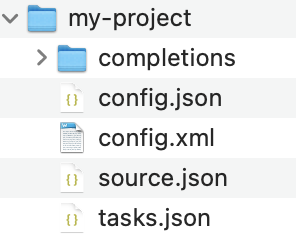

# EasyAL
Modular Active Learning Package for Image classification with state of the art active learning strategy

# Requirement
 - [Dependencies](./pyproject.toml)

# Installation
- install label studio with command $pip install label-studio
- run command line $cd [the path you pull EasyAL package folder to]/EasyAL 
- run command line $poetry shell and then $poetry install to install all dependencies for EasyAL

# Getting Started
Guide to create label studio work folder and start active learning loop:

- manually create a configuration file, config.xml(see example folder)
- Have a folder with images for annotation
- run command line  $label-studio init [your label studio project name] --input-path=[path of image folder] --input-format=image-dir --label-config=[path of the config file/config.xml] --allow-serving-local-files
- A folder with the following structure will appear in your current path 

   

- Run label-studio start ./[your label studio project name] and your browser with launch automatically with the label studio interface
- Choose the labeling button on the top of the interface to begin labeling
- After your first round of labeling, change environment variable  "sampling": "sequential" in ./[your label studio project name]/.config.json to "sampling": "prediction-score-max" to activate active learning mode for future rounds
- using the functions in utils.py to parse JSON files in [your label studio project name]/completions folder and update the labels of images in your self-create dataset(see example folder for an active learning loop)
- Visit https://labelstud.io/ for any question related to label studio

# Reference

- [D. Lewis and W. Gale. A sequential algorithm for training text classifiers. in proceedings of
the acm sigir conference on research and development in information retrieval, pages 3–12.
acm/springer, 1994.](https://arxiv.org/abs/cmp-lg/9407020)

- [Tobias Scheffer, Christian Decomain, and Stefan Wrobel. Active hidden markov models for
information extraction, 2001.](https://link.springer.com/chapter/10.1007/3-540-44816-0_31)

- [Donggeun Yoo and In So Kweon. Learning loss for active learning, 2019.](https://arxiv.org/abs/1905.03677)

- [Ozan Sener and Silvio Savarese. Active learning for convolutional neural networks: A core-set
approach, 2018.](https://arxiv.org/abs/1708.00489)

- [Seong Tae Kim, Farrukh Mushtaq, and Nassir Navab. Confident coreset for active learning in
medical image analysis, 04 2020.](https://arxiv.org/abs/2004.02200)

- [Qizhe Xie, Minh-Thang Luong, Eduard Hovy, and Quoc V. Le. Self-training with noisy student
improves imagenet classification, 2020.](https://arxiv.org/abs/1911.04252)

- [Samuli Laine and Timo Aila. Temporal ensembling for semi-supervised learning, 2017.](https://arxiv.org/abs/1610.02242)

- [Antti Tarvainen and Harri Valpola. Mean teachers are better role models: Weight-averaged
consistency targets improve semi-supervised deep learning results, 2018.](https://arxiv.org/abs/1703.01780)

